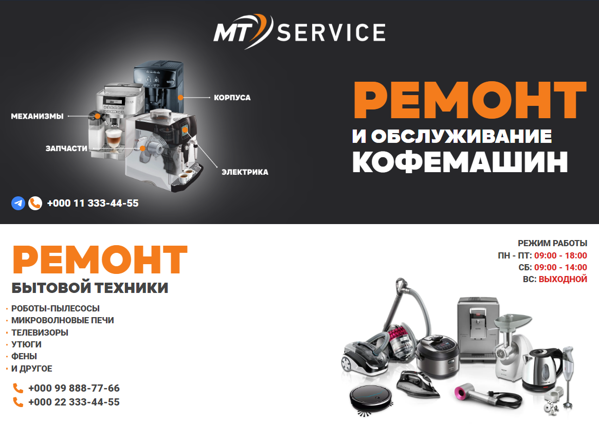

# MT SERVICE

> Одностраничный сайт визитка для сервиса по ремонту бытовой техники.  
> Сайт разработан для реального заказчика. Интерфейс и функционал полностью соответствует его техничским заданиям.

---

**Используемые технологии:**
- Vite
- TailwindCSS
- React
- React Context
- Yandex Maps API
- Github Actions

**Фичи:**
- UI библиотека с нуля
- Полностью адаптивный макет
- Кастомные хуки
- SEO Оптимизация
- Спрайт SVG иконок
- Транслитерационный поиск
- Просмотр локации на карте 
- Автодэплой на Github Pages 

